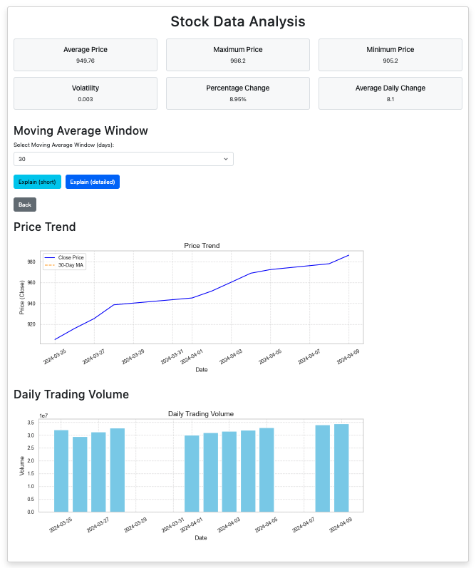

# 📊 Stock Data Analysis Application

This project is a **Flask-based web application** designed to analyze stock market data from CSV files. Users can upload a CSV file containing stock data, and the application generates a detailed report with key statistics, visualizations, and AI-powered explanations.

---

## ✨ Features

- **CSV File Upload**: Upload stock data in CSV format with columns like `Date`, `Open`, `High`, `Low`, `Close`, and `Volume`.
- **Data Analysis**:
  - Calculates key metrics such as average, maximum, and minimum closing prices.
  - Computes moving averages, daily percentage changes, and volatility.
- **Visualizations**:
  - Generates a line chart for price trends and a bar chart for daily trading volume using `matplotlib` and `seaborn`.
- **AI-Powered Explanations**:
  - Provides beginner-friendly insights into stock performance using OpenAI's GPT model.
  - Offers both short and detailed explanations.
- **Dynamic Reports**:
  - Displays analysis results in a user-friendly HTML report with interactive options for moving average windows.
- **Error Handling**:
  - Handles invalid or incomplete CSV files gracefully with clear error messages.

---

## 🛠️ Technologies

- **Programming Language**: Python
- **Framework**: Flask
- **Libraries**:
  - Data Processing: `pandas`, `numpy`
  - Visualization: `matplotlib`, `seaborn`
  - Environment Management: `python-dotenv`
  - AI Integration: `openai`
- **Frontend**:
  - HTML templates with Bootstrap for responsive design
  - CSS for custom styling
- **Testing**: `pytest`

---

## 🚀 Installation

Follow these steps to set up the project locally:

1. **Clone the Repository**:
   ```bash
   git clone <repository-url>
   cd ohke-teknologia\ seminaari/porssi-analyysi
   ```

2. **Set Up a Virtual Environment**:
   ```bash
   python -m venv venv
   source venv/bin/activate  # On Windows: venv\Scripts\activate
   ```

3. **Install Dependencies**:
   ```bash
   pip install -r requirements.txt
   ```

4. **Set Up Environment Variables**:
   - Create a `.env` file in the project root and add your OpenAI API key:
     ```
     OPENAI_API_KEY=your_openai_api_key
     ```

5. **Run the Application**:
   ```bash
   python app.py
   ```

6. **Access the Application**:
   - Open your browser and navigate to `http://127.0.0.1:5000`.

---

## 💥 Usage

1. **Upload a CSV File**:
   - Go to the homepage and upload a CSV file containing stock data.
   - Example CSV format:
     ```csv
     Date,Open,High,Low,Close,Volume
     2024-03-25,172.35,174.00,171.55,173.20,23456100
     ```

2. **View the Report**:
   - After uploading, you'll be redirected to a report page displaying:
     - Key metrics (average, max, min prices, etc.)
     - Price trend chart
     - Volume chart (if available)

3. **Get AI Explanations**:
   - Use the "Explain (short)" or "Explain (detailed)" buttons to get insights into the stock's performance.

4. **Adjust Moving Average Window**:
   - Select a different moving average window (e.g., 5, 10, 30 days) to update the trend chart dynamically.

---

## ⚙️ Configuration

- **Environment Variables**:
  - `OPENAI_API_KEY`: Your OpenAI API key for generating explanations.
- **File Uploads**:
  - Uploaded files are stored in the `uploads/` directory.
- **Static Files**:
  - Generated charts are saved in the `static/` directory.

---

## 🧪 Testing

Run the test suite using `pytest`:

1. **Install pytest**:
   ```bash
   pip install pytest
   ```

2. **Run Tests**:
   ```bash
   pytest tests/
   ```

3. **Test Coverage**:
   - Tests include:
     - Homepage loading
     - CSV upload and redirection
     - Data processing and calculation validation

---

## 📂 Project Structure

```
ohke-teknologia seminaari/
├── porssi-analyysi/
│   ├── app.py                # Main Flask application
│   ├── templates/            # HTML templates
│   │   ├── upload.html       # Upload page
│   │   ├── report.html       # Report page
│   ├── static/               # Static files (CSS, images)
│   │   ├── style.css         # Custom styles
│   ├── uploads/              # Uploaded CSV files
│   ├── tests/                # Test suite
│   │   ├── test_app.py       # Unit tests for the app
│   ├── requirements.txt      # Python dependencies
│   ├── .env                  # Environment variables
│   ├── .gitignore            # Ignored files and directories
├── README.md                 # Project documentation
```

---

## 🌟 Example Screenshots

### Upload Page


### Report Page


---

## 🔗 Useful Links

- [Flask Documentation](https://flask.palletsprojects.com/)
- [pandas Documentation](https://pandas.pydata.org/)
- [matplotlib Documentation](https://matplotlib.org/)
- [OpenAI API](https://platform.openai.com/docs/)